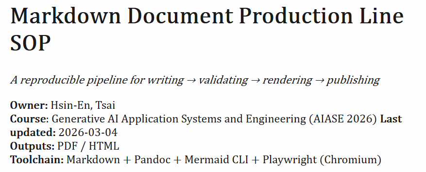
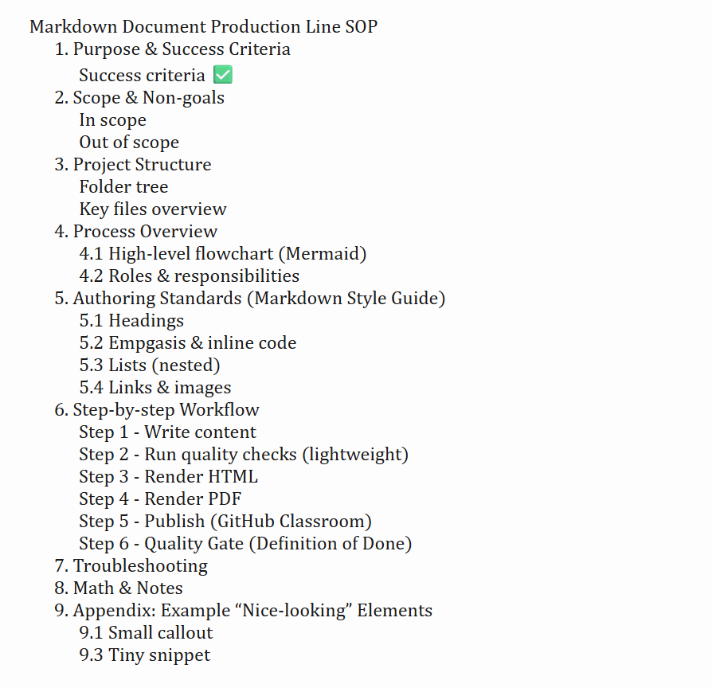
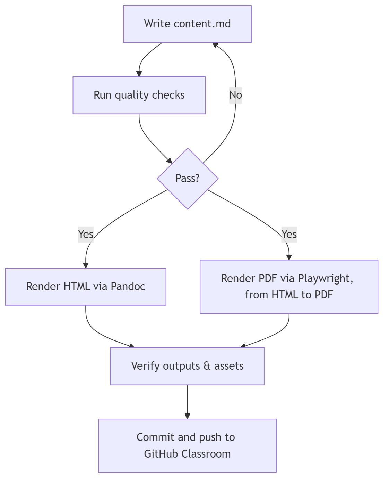

# Markdown Document Production Line (SOP)

This repository demonstrates **Decoupling Content and Rendering**: writing a rich `content.md` (single source of truth) and rendering it into **HTML + PDF** using a reproducible pipeline.

**Owner:** Hsin-En, Tsai  
**Course**: Generative AI Application Systems and Engineering (AIASE 2026)
**Last updated:** 2026-03-04  
**Outputs:** PDF / HTML  
 
---

## 1) Required Structure

Repo should look like this:

```text
AIASE2026-HW1/
├── content.md                # main markdown content (required)
├── README.md                 # this file (required)
├── assets/
│   └── flowchart.mmd         # Mermaid source for workflow diagram
├── tools/
│   └── print_pdf.js          # HTML -> PDF automation using Playwright
└── output/
    ├── output.html           # rendered HTML
    ├── output.pdf            # rendered PDF
    ├── flowchart.png         # generated Mermaid image
    ├── preview-html.png      # (optional) screenshot of HTML output
    └── preview-html-2.png    # (optional) screenshot of TOC/sections
```
> Note: All images referenced by content.md must exist in the repo (committed), otherwise they will not render on another machine.

## 2) Toolchain Overview
- Pandoc: Markdown → HTML
- Mermaid CLI (mmdc): Mermaid (.mmd) → PNG image
- Playwright (Chromium): HTML → PDF (no LaTeX required)
This design avoids LaTeX dependency issues and improves reproducibility across clean environments.

## 3) Dependencies / Requirements
This project does **not** require any Python packages (see `requirements.txt`, which is intentionally informational only).

### Required
- **Pandoc (CLI)** — render `content.md` → `output/output.html`
- **Node.js + npm** — required to run Mermaid CLI and Playwright
- **Mermaid CLI (`mmdc`)** — render `assets/flowchart.mmd` → `output/flowchart.png`
- **Playwright (Node) + Chromium** — render `output/output.html` → `output/output.pdf` (no LaTeX needed)

### Optional
- **LaTeX (MiKTeX/TeX Live)** — *not required* in this repo. PDF is generated via Playwright for better reproducibility.

### Python dependencies (optional)

This repo does **not** require Python packages.  
`requirements.txt` is provided for completeness, but it is intentionally empty (informational only).

If you still want to run it:
```bash
pip install -r requirements.txt
```

## 4) Prerequisites
### 4.1 Install Pandoc (required)
Check (PowerShell):
```PowerShell
pandoc --version
```
If missing (Windows):
```PowerShell
winget install --id JohnMacFarlane.Pandoc -e
```

### 4.2 Install Node.js + npm (required for Mermaid CLI + Playwright)
Check (PowerShell):
```PowerShell
node -v
npm -v
```
If missing (Windows):
```PowerShell
winget install OpenJS.NodeJS.LTS -e
```
If **npm** is blocked in PowerShell (ExecutionPolicy error), run once:
```PowerShell
Set-ExecutionPolicy -Scope CurrentUser -ExecutionPolicy RemoteSigned
```
Re-open PowerShell, then retry **npm -v**.

## 5) One-time Setup (first run only)
### 5.1 Install Mermaid CLI globally (PowerShell)
```PowerShell
npm install -g @mermaid-js/mermaid-cli
```
Verify:
```PowerShell
mmdc -h
```
### 5.2 Install Playwright in this project (recommended for reproducibility)
```PowerShell
npm init -y
npm install playwright
npx playwright install chromium
```

## 6) Expected Outputs

After running the build steps, the following files should exist:

| Path | Format | Description |
|---|---|---|
| `output/output.html` | HTML | Styled HTML rendered from `content.md` (TOC enabled + CSS applied). |
| `output/output.pdf` | PDF | PDF printed from `output/output.html` using Playwright (no LaTeX required). |
| `output/flowchart.png` | PNG | Workflow diagram image generated from `assets/flowchart.mmd`. |
| `output/image.png` | PNG | (Optional) Screenshot preview (cover/title). |
| `output/image-1.png` | PNG | (Optional) Screenshot preview (TOC + sections). |

Quick check:
```PowerShell
dir output
```

## 7) Outputs (HTML + PDF)
From the repo root:

**Step 1 - Generate workflow diagram image (Mermaid → PNG)**
```PowerShell
mkdir output -Force
mmdc -i assets/flowchart.mmd -o output/flowchart.png -b transparent -s 2
```
**Step 2 - Render HTML (Markdown → HTML)**
```PowerShell
pandoc content.md -s --toc -c ../assets/style.css -o output/output.html
```
Open HTML to verify:
```PowerShell
start output\output.html
```
> Styling: `assets/style.css` is applied via Pandoc `-c` to improve readability of headings, tables, code blocks, and blockquotes.

**Step 3 - Render PDF (HTML → PDF, automated; no LaTeX)**
```PowerShell
node tools\print_pdf.js
```
Open PDF to verify:
```PowerShell
start output\output.pdf
```
## 8) What to Submit (GitHub Classroom)
Commit and push:
- `content.md`
- `README.md`
- `assets/flowchart.mmd`
- `tools/print_pdf.js`
- `output/` rendered artifacts (at least one: `output.html` or `output.pdf`)

Recommended:
```PowerShell
git add content.md README.md assets/ tools/ output/
git commit -m "HW1: reproducible markdown production line outputs"
git push
```
## 9) Notes on Images (important)
Because `output/output.html` is inside the `output/` folder, image paths referenced in content.md should be **relative** to `output/`.

✅ Recommended (images stored in `output/`):
```Markdown



```
❌ Avoid in this layout (will become `output/output/...` and break):
```Markdown

```

## 10) Troubleshooting
### 10.1 `pandoc` not recognized
- Pandoc is not installed or not in PATH.
- Re-open terminal after installation.
- Check:
```PowerShell
where.exe pandoc
```
### 10.2 `mmdc` not recognized
- Mermaid CLI not installed.
- Install:
```PowerShell
npm install -g @mermaid-js/mermaid-cli
```
### 10.3 Mermaid parse error
- Avoid special symbols like `->` or parentheses inside node labels.
- Prefer:
    - `HTML to PDF` instead of `HTML -> PDF`
    - avoid parentheses when possible
### 10.4 Cannot find module 'playwright'
- Install Playwright in project
```PowerShell
npm install playwright
npx playwright install chromium
```
### 10.5 PDF looks different from VS Code preview
- VS Code preview uses different renderer/styling.
- Use `output/output.html` as the source for PDF via Playwright to keep HTML/PDF consistent.

## 11) References
```md
Official documentation used in this project:

- Pandoc Manual: https://pandoc.org/MANUAL.html
- Mermaid Documentation: https://mermaid.js.org/
- Mermaid CLI (`mmdc`) docs: https://github.com/mermaid-js/mermaid-cli
- Playwright (Node) docs: https://playwright.dev/
- Node.js downloads/docs: https://nodejs.org/
```
